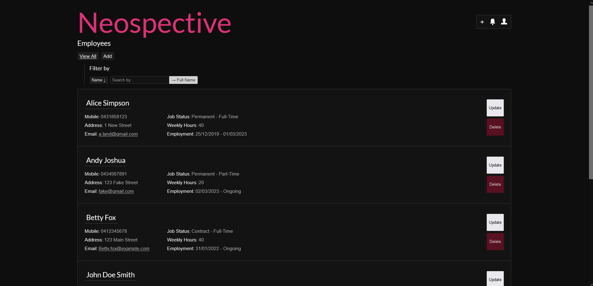
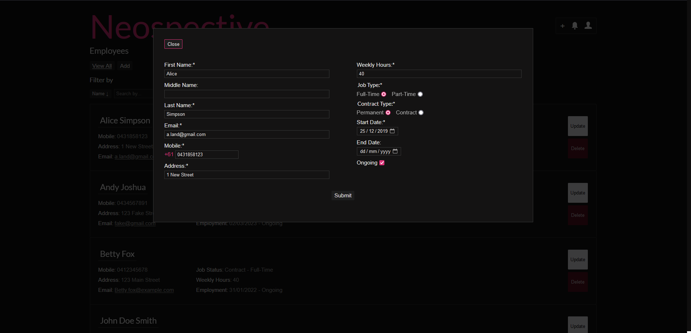
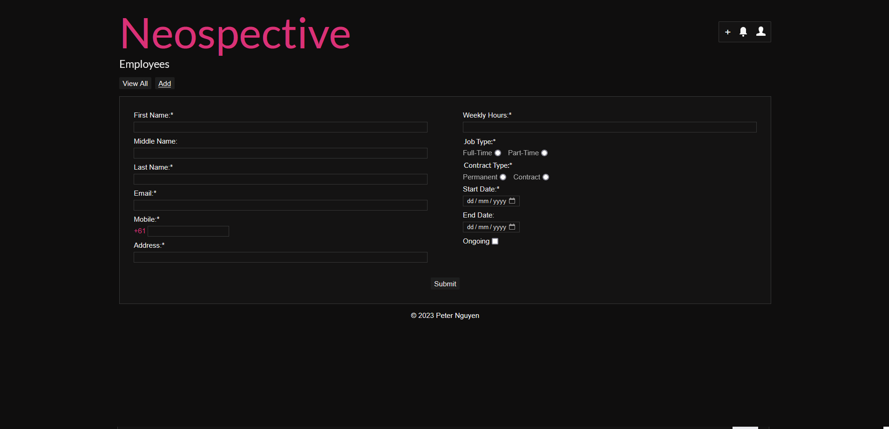
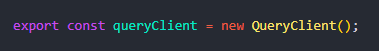

# Employee Creator


## Application Snippets

### Home Page


### Update Modal


### Create Page


## Requirements / Purpose
- A full-stack web application with CRUD functionality
- SpringBoot for the backend API - (includes end-to-end testing)
- Vite/React/TS for the frontend - (includes unit testing)
- SASS for styling
This application is an attempt at a full-stack application with a common stack typically used by companies in Australia. It's essentially a proof-of-concept of my skill. 

## Features 
- Allows users to:
  - Get employees
  - Create employees
  - Update employees
  - Delete employees
 - Has filter logic based on user-text input, filter can be set to name, email, address or mobile
 - Has a sort-by-ascending/descending order logic (just for name)

## Build Steps
### To run this application you will need to do several things.
Backend:
 - Create and connect to a MySQL database of the name 'employee-creator'. To also include some data I recommended using this code snippet.
 ```
 CREATE DATABASE employee_creator;
USE employee_creator;

CREATE TABLE employee(
id INT UNSIGNED NOT NULL AUTO_INCREMENT,
firstName VARCHAR(255) NOT NULL,
middleName VARCHAR(255),
lastName VARCHAR(255) NOT NULL,
email VARCHAR(255) NOT NULL,
mobile VARCHAR(255) NOT NULL,
address VARCHAR(255) NOT NULL,
contractType VARCHAR(255) NOT NULL,
jobType VARCHAR(255) NOT NULL,
weeklyHours INT UNSIGNED NOT NULL,
startDate DATE NOT NULL,
endDate DATE,
PRIMARY KEY(id)
);

INSERT INTO employee (firstName, middleName, lastName, email, mobile, address, contractType, jobType, weeklyHours, startDate, endDate)
VALUES 
('John', 'Doe', 'Smith', 'johndoe@example.com', "0431581851", '123 Main St', 'Permanent', 'Full-Time', 40, '2022-01-01', '2022-12-31'),
('Jane', 'Marie', 'Johnson', 'janejohnson@example.com', "0435163481", '456 Elm St', "Contract", 'Part-Time', 20, '2022-02-01', '2022-05-31');
 ```
 - Next you will need an .env file at the root level of the SpringBoot application (employee-creator-api). Where ```<USERNAME>``` and ```<PASSWORD>``` are replaced by your database username and password. For example my values are ```root``` and ```helloworld1``` respectively.
```
SPRING_DATASOURCE_DEV_URL=jdbc:mysql://localhost:3306/employee_creator
SPRING_DATASOURCE_DEV_USERNAME=<USERNAME>
SPRING_DATASOURCE_DEV_PASSWORD=<PASSWORD>
```
 - You now should be able to run the SpringBoot application. I recommend using Eclispse as that's what I've used to develop this but any IDE with JVM should work. 
 
Frontend:
- You can run the frontend by simply running the following code snippet at the root level of the React application (employee-creator-frontend). 
```
npm install
npm run dev
```

Deployment to come soon...

## Design Goals
- The dependencies installed (ReactQuery, React-Hook-Forms, ReduxToolkit) were used as proof of concept that reflected something I would see in larger codebases, where DX, maintability and scalability are a concern. I was also quite comfortable writing simple custom hooks, using vanilla forms and using ReactContext so I thought it was time to up-skill a little further.

## Problems Encountered
To preface, this was my first time using these front-end libraries (specified above). Originally I wanted to also include MockServiceWorker and Twin.macro as well but was encountering issues implementing them in a test environment alongside everything else. It's likely this issue was caused by this export in main.tsx instead of App.tsx.



However I was convinced it was an issue with my babel transformation (which was necessary for MSW at the time). I'm confident I can resolve these issues the next time I use these dependencies. 

## Future Goals
- Refactor front-end code to make it more easily scalable.

